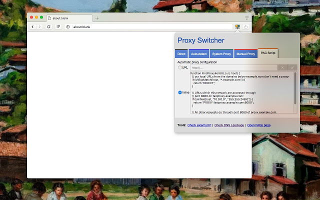

# Czasopisma przez proxy PRz bez niedogodności:
Wygodny dostęp do wydawnictw udostępnianych przez PRz na przeglądarkach opartych na Chromium (Chrome/Chromium/Opera/Vivaldi/Microsoft Edge/...).

Przetestowane na: 

 - Debian 10 Buster, Vivaldi 2.10
 - Windows 10, Vivaldi 3.3

## Sposób instalacji

1. Zainstaluj dodatek do przeglądarki [Proxy Switcher]( https://chrome.google.com/webstore/detail/proxy-switcher-and-manage/onnfghpihccifgojkpnnncpagjcdbjod).
2. W prawym górnym rogu przeglądarki pojawi ikona z ekranem. Po jej kliknięciu pojawi się okno jak poniżej:
  
3. Wybieramy zakładkę PAC Script.  
   Mamy do wyboru dwie opcje:
    * Sposób pierwszy:
      1. Zaznaczamy opcję 'Inline'. 
      2. Z pola tekstowego po prawej stronie usuwamy treść (o ile się tam jakaś znajduje), a następnie wklejamy zawartość pliku [przproxy.pac](https://raw.githubusercontent.com/przemarbor/przproxyczasopisma/master/przproxy.pac).  
    * Sposób drugi:
	  1. Wybieramy opcję 'URL', a w polu obok wklejamy adres do pliku .pac, czyli: https://raw.githubusercontent.com/przemarbor/przproxyczasopisma/master/przproxy.pac 
	  
    Treść pliku .pac instruuje przeglądarkę, aby dostęp do stron wydawnictw, który wymaga autoryzacji był przekierowywany przez serwer proxy PRz. Wszelki pozostały ruch będzie odbywał się normalnie, bez użycia proxy. 
 
 
4. Po wpisaniu loginu i hasła zgodnie z danymi dostępnymi na [stronie USK](https://usk.prz.edu.pl) powinno dać się korzystać z internetu bez niedogodności.

## Przydatne linki:
 - Plik .pac podpatrzony tutaj: https://www.cyberciti.biz/faq/howto-use-auto-config-proxy-pac-file-for-specific-domain/

## TODO
 - Wykorzystać przy uruchomieniu przeglądarki parametr [`-proxy-pac-url=<pac-file-url>`](https://www.chromium.org/developers/design-documents/network-settings) (+ ścieżka do pliku lokalnego `file://...` lub zdalnego `http://...`)  , żeby metoda działała bezpośrednio na pliku .pac bez potrzeby instalowania Proxy Switchera
 - zmusić Vivaldi do otwierania wybranego profilu zawsze z opcją `-proxy-pac-url=`
 - wrzucić .pac na serwer prz, żeby uniezależnić metodę od serwerów github.
